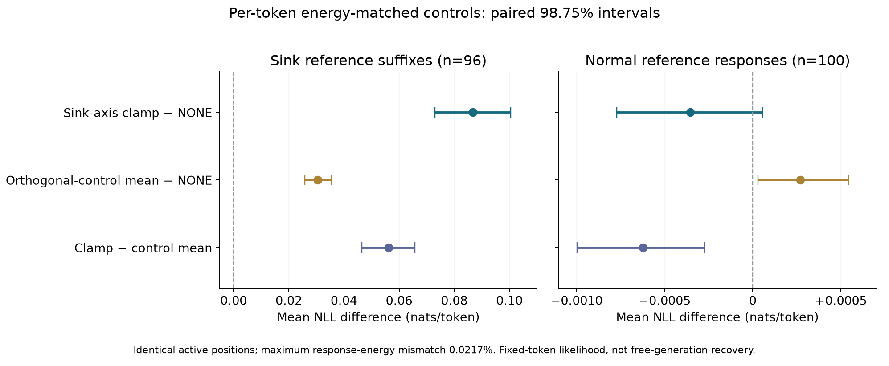

# Sink轴能量匹配对照：结果与正文段落

**结论：预定检验通过。** 在保持修改token位置和实际逐token改变量一致后，C1仍比全部10个正交方向对照更强地降低sink参考续写的似然。现在可以写一条方向敏感的功能结果；不据此声称自由生成更容易逃离sink或恢复正确答案。

## 1. 主要结果

Qwen2-7B-Instruct，原block14。沿用原96道sink B题、100道normal M_B题、原token和截断点。正常M_B按原自动评分正确且boxed选择，并非独立人工金标准。共有NONE、C1、5个各向同性正交方向、5个非sink中心差正交方向，共 **2,352/2,352** 次完整前向。

单位为nats/token。正值表示对固定参考文本的支持降低。每道题是统计单位；主要区间采用100,000次配对bootstrap、98.75%覆盖率。

| 比较 | sink后缀NLL增量，96题 | 98.75%区间 | normal全文NLL增量，100题 | 98.75%区间 |
|---|---:|---|---:|---|
| C1 − NONE | **+0.086711** | **[+0.072915,+0.100445]** | −0.000354 | [−0.000772,+0.000055] |
| 10个能量匹配对照均值 − NONE | +0.030570 | [+0.025785,+0.035491] | +0.000269 | [+0.000030,+0.000543] |
| **C1 − 对照均值** | **+0.056140** | **[+0.046427,+0.065800]** | **−0.000623** | **[−0.000997,−0.000274]** |

原先对照改变量太小确实低估了普通扰动的效果：匹配之后，对照的平均效应增至0.0306。不过，C1的0.0867仍更大；“只是改得更多”不足以解释现在的配对差异。

正常题上，C1相对NONE的点估计很小且区间跨零；不能把非显著性当作等效性证明。相对十个匹配对照的均值，C1的NLL略低，区间不跨零。

## 2. 十个对照全部保留

每项为sink组C1减去该方向的NLL差，**99.5%区间对应十项Bonferroni校正**。

| 对照 | 对照自身相对NONE的ΔNLL | C1额外ΔNLL | 99.5%区间 |
|---|---:|---:|---|
| ISO1 | 0.024299 | 0.062412 | [0.050431,0.074292] |
| ISO2 | 0.019125 | 0.067586 | [0.054656,0.080447] |
| ISO3 | 0.015154 | 0.071557 | [0.058387,0.084598] |
| ISO4 | 0.012388 | 0.074323 | [0.060937,0.087575] |
| ISO5 | 0.023612 | 0.063098 | [0.051680,0.074293] |
| MAN1 | 0.043315 | 0.043396 | [0.034063,0.052846] |
| **MAN2** | **0.051113** | **0.035597** | **[0.026508,0.044836]** |
| MAN3 | 0.045150 | 0.041561 | [0.031669,0.051477] |
| MAN4 | 0.040494 | 0.046217 | [0.036787,0.055668] |
| MAN5 | 0.031054 | 0.055656 | [0.044036,0.067237] |

不仅预定的“主差值区间为正＋超过全部10个点均值”通过，**全部10项校正区间也都为正**。表中MAN2是点估计最大的对照，其与C1的差仍清楚大于零。不得将这十个预定方向概括为所有可能方向。

## 3. 改变量是否真的匹配？

原C1算子不变。对每个token先计算原C1经过BF16舍入后的实际改变量norm；对照使用相同活跃位置，沿预定正交方向改变相同大小。标量二分与必要的确定性舍入修正只访问activation和norm，不访问NLL或正确性。

| 每token实际改变量norm，先每题平均再跨题平均 | C1 | 十个对照范围 |
|---|---:|---:|
| sink96 | **4.5830948** | **4.5830904–4.5830950** |
| normal100 | **0.3722385** | **0.3722373–0.3722387** |

- 所有token活跃掩码一致，零改动位置保持完全不变。
- 所有token满足原来的 `1%×目标norm＋1e−4` 误差门槛；实际最大误差仅占这个门槛的4.99%。
- 任一回答的总平方改变量相对误差最大为 **0.02163%**，低于预定0.2%。
- sink对照实际改变量与指定方向的能量加权余弦为 **0.999961–0.999965**；normal为 **0.999650–0.999726**。
- 控制方向理论上正交。BF16实际增量对sink轴的能量加权RMS余弦为sink **0.000547–0.000608**，normal **0.001205–0.001855**。少数低能量token的最大绝对余弦分别可到0.136、0.120，故不称实际浮点增量严格逐token正交。
- 舍入修正触及sink对照8,824/760,690个活跃token记录，normal2,529/78,830；其余用标量二分即可匹配。所有修正均计入实际norm与方向审核。

NONE及C1共392个每题NLL，与先前冻结结果的最大差值为 **0.0**。没有靠改模型、改原C1、换题或换评分窗口获得新结果。

## 4. 建议正文7.4：四句话

**Clamping the sink axis suppresses sink-associated continuations.** At block 14, clamping excess activation along the HSS sink axis increased the NLL of sink-associated continuations by 0.0867 nats/token (98.75% CI [0.0729, 0.1004]; 96 responses). Ten orthogonal control directions, matched in active token positions and actual per-token update norm, increased NLL by 0.0306 [0.0258, 0.0355], yielding a paired difference of 0.0561 [0.0464, 0.0658]; C1 also exceeded every individual control after Bonferroni correction. On 100 normal reference responses, the NLL change was small (−0.00035 [−0.00077, 0.00005]). This establishes a direction-sensitive effect on support for sink-associated reference continuations, without establishing improved free-generation recovery.

### 可加入主表的一行

| Intervention | Sink ΔNLL vs. none | Matched-control ΔNLL | Paired difference [98.75% CI] | Normal ΔNLL vs. none |
|---|---:|---:|---|---:|
| Sink-axis clamp (block14) | +0.0867 | +0.0306 | **+0.0561 [0.0464,0.0658]** | −0.00035 |

### 附录方法／限制

The clamp removed projection above the frozen 75th-percentile threshold estimated from normal training tokens. Five isotropic and five non-sink centroid-difference directions were orthogonalized against the sink axis without resampling or outcome-based selection. Controls used the same active positions and matched the realized BF16 C1 update norm token by token; deterministic rounding corrections were applied where scalar quantization prevented accurate matching. The maximum response-level energy mismatch was 0.0217%. We used 100,000 paired question bootstrap resamples, 98.75% intervals for the primary contrast, and 99.5% intervals for the ten individual contrasts. The protocol was frozen before evaluating the new controls but followed a post-hoc finding on the same previously inspected questions; it is not fresh-sample confirmation. Sink NLL was evaluated on the frozen response suffix, whereas normal NLL used the full reference response. The normal cohort was selected for automated correctness and complete boxed answers. Previously fitted maps were reused; the sink axis and threshold were estimated from the separate A split. Historical collection used repetition_penalty=1.05; teacher forcing here scores raw fixed-token likelihoods without a generation repetition processor. No new free-generation recovery experiment was performed.

行为分析可在附录写：

> A separate within-question analysis did not establish coupling between changes in sink membership and the predefined degeneration status (exact conditional p=0.197).

0.0867 nats对应参考token概率的**几何平均比**约为exp(−0.0867)=0.917；不写作“算术平均概率下降8%”，也不将跨token概率乘积解释为观察到的自由生成成功率。

## 5. 执行、审核与来源

正式v3前向耗时 **399.65秒（6分40秒）**，另有模型载入、实现和审计时间。之前v1/v2分别在31/307条记录时被严格数值门槛挡住并停止；原文件保留，未用于效应比较。修订只加强BF16匹配算法，没有放宽门槛、换题、换方向或修改判定标准。

GPU记录全部保存，CPU审核覆盖2,352条JSON/NPZ哈希、逐token记录的norm与mask、评分重算、NONE/C1重放及完整条件矩阵。另在本地用独立index-resampling20,000次复核：主差值区间 [0.04650,0.06583]，十项校正区间仍全部大于零。它是实现交叉核验，不是第二个独立科学样本。

- 协议：[sink-energy-matched-protocol-20260925.zh-CN.md](sink-energy-matched-protocol-20260925.zh-CN.md)
- 机器可读结果：[summary.json](sink-energy-matched-20260925/summary.json)
- 原始审核：[audit_SUCCESS.json](sink-energy-matched-20260925/audit_SUCCESS.json)
- 独立复核：[independent_local_audit.json](sink-energy-matched-20260925/independent_local_audit.json)
- 完整原始结果：`/lambda/nfs/dami/hss/sink-energy-matched-20260925-v3`
- 本地轻量结果：`results/sink-energy-matched-20260925-v3`
- 冻结plan SHA256：`e6160a759f354a05b6461823d792fa8fe3bead7c143920d73d6179a6f8ca44b3`
- 评分表SHA256：`52e8b92342777e3cc52cca69fdcc4562a1daf7e48caf23cefbbfcb5a2b3fb840`
- 结果SHA256：`22a58cdb78ff9e689979612e8bea055097e4f6c2dda197605738e46ad701b4ad`

