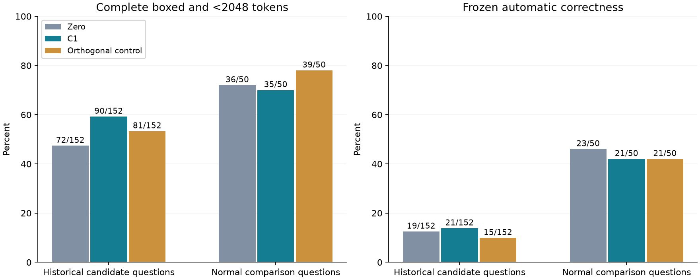

# HSS sink 推广实验：结果

更新：2026-09-25T22:17:26.207541+00:00。只展示完整、通过原始记录审核的实验。

[冻结协议](sink-next-protocol-20260925.zh-CN.md) · [此前 v3 能量匹配结果](sink-energy-matched-results-20260925.zh-CN.md)

**性质：探索性延伸，沿用此前已经检查过的问题；不是新样本确认实验。** NLL 单位为 nats/token，正差表示模型对既定参考续写的支持下降。

## 1. 同题型、同难度

96 对精确匹配；放宽一级 0 对；未匹配 0 条。两组都使用 half_sentence 后半段窗口。

| 量 | 均值 [95% CI] |
|---|---:|
| Sink：C1−NONE | 0.09165 [0.08063, 0.10263] |
| 匹配非 sink：C1−NONE | 0.00459 [0.00225, 0.00744] |
| 主终点：匹配对差 | **0.08706 [0.07638, 0.09768]** |

| 组 | 越界 token 比例（逐题均值） | 正超出量均值 | 实际更新范数均值 |
|---|---:|---:|---:|
| matched | 34.83% | 1.13246 | 1.13298 |
| sink | 66.56% | 4.58257 | 4.58309 |

结果超出已匹配的题型和难度。仍可能存在长度、回答内容等差异；两组自然截断的实际剂量不同，所以不把本项单独解释为完全排除题目因素或证明生成模式。

本项 sink NLL 与 v3 的数值不同，是因为按预定规格统一改为 half_sentence，而 v3 包含 first_repeat 窗口。

English: With problem type and difficulty matched in 96 independent pairs, the sink-minus-control difference in the clamp-induced NLL increase was 0.0871 nats/token (95% CI [0.0764, 0.0977]).

## 2. 深度扫描

主列为 sink 的 C1−10 个对照均值；六个新层区间为 99.1667%（Bonferroni 6）。normal 列为描述性95%区间。

| Index | Sink 主对比 [校正 CI] | Normal C1−NONE [95% CI] | Normal C1−对照 [95% CI] | cos(axis, axis14) |
|---|---:|---:|---:|---:|
| 4 | 0.01483 [0.01220, 0.01751] | 0.00019 [-0.00005, 0.00043] | 0.00019 [-0.00002, 0.00040] | 0.41670 |
| 8 | 0.02196 [0.01758, 0.02643] | -0.00017 [-0.00046, 0.00010] | -0.00019 [-0.00041, 0.00001] | 0.72233 |
| 12 | 0.04214 [0.03437, 0.04999] | -0.00029 [-0.00062, 0.00005] | -0.00040 [-0.00070, -0.00011] | 0.89705 |
| 16 | 0.09967 [0.08253, 0.11699] | -0.00055 [-0.00091, -0.00018] | -0.00080 [-0.00113, -0.00050] | 0.90327 |
| 20 | 0.11466 [0.09313, 0.13650] | -0.00095 [-0.00135, -0.00054] | -0.00132 [-0.00171, -0.00095] | 0.75352 |
| 24 | 0.00402 [-0.00251, 0.01106] | -0.00222 [-0.00275, -0.00170] | -0.00273 [-0.00334, -0.00214] | 0.61532 |

Index14 复用 v3：0.05614 [0.04643, 0.06580]，98.75% CI；未重新纳入六个新层的校正。

| Index | Sink 越界比例 | Normal 越界比例 | Sink 实际更新范数 | Normal 实际更新范数 |
|---|---:|---:|---:|---:|
| 4 | 48.74% | 22.67% | 1.31613 | 0.24368 |
| 8 | 58.25% | 21.11% | 2.72304 | 0.31400 |
| 12 | 63.75% | 20.35% | 4.04858 | 0.38453 |
| 16 | 63.84% | 20.06% | 5.34409 | 0.45400 |
| 20 | 64.13% | 19.79% | 9.60938 | 0.78149 |
| 24 | 58.11% | 20.71% | 19.47538 | 2.15569 |

每层单独干预，同一评估人群和窗口。完整10个对照保存在 JSON 中。层间效应曲线不是等剂量比较，不能直接称最大效应层为最重要层。

## 3. 四个其他高占用状态

主列为 in-state 的 C1−对照均值，98.75%区间（Bonferroni 4）；in−out为次要95%区间，两个组独立重采样。

| 状态 | 训练人数 | 训练正确率 | 主导题型 | In-state 主对比 | Out-state 对比 | In−out 差 |
|---|---:|---:|---|---:|---:|---:|
| 2 | 186 | 54.8% | prealgebra | 0.00217 [0.00081, 0.00370] | -0.00007 [-0.00044, 0.00031] | 0.00224 [0.00108, 0.00347] |
| 1 | 179 | 35.2% | intermediate_algebra | 0.00143 [0.00019, 0.00271] | 0.00008 [-0.00018, 0.00034] | 0.00135 [0.00034, 0.00238] |
| 9 | 157 | 39.5% | number_theory | 0.00628 [0.00359, 0.00935] | -0.00002 [-0.00035, 0.00033] | 0.00630 [0.00413, 0.00871] |
| 29 | 150 | 46.0% | intermediate_algebra | 0.01275 [0.00918, 0.01675] | 0.00027 [-0.00013, 0.00072] | 0.01247 [0.00958, 0.01556] |

只检验预选的四个高占用状态。in-state 显著而 in−out 不显著时，不能声称状态特异；多数成立也不能外推所有状态。组间自然截断剂量不同，in−out的95%区间为次要、未作四重校正。

## 4. 自由生成

主终点：完整非空 boxed，且生成长度不足2048。不要与仅 boxed 或自动正确率混用。

| 条件 | Sink 完整且未截断 /152 | Sink 正确 /152 | 正常完整且未截断 /50 | 正常正确 /50 | Sink 退出/进入（相对 zero） |
|---|---:|---:|---:|---:|---|
| zero | 72 | 19 | 36 | 23 | 0 / 0 |
| C1 | 90 | 21 | 35 | 21 | 50 / 8 |
| ORTH_MAN_1 | 81 | 15 | 39 | 21 | 23 / 17 |

C1 对 zero：改善36题，损伤18题，净+18；双侧精确p=0.0198343，Holm校正p=0.0396687。

C1 对 ORTH_MAN_1：改善31题，损伤22题，净+9；双侧精确p=0.271679，Holm校正p=0.271679。

预定‘对两组均改善且显著’规则：**False**。

在线对照匹配本组当前激活上的更新规则，各组文本分叉后不保证累计能量相同。重新编码是在无干预模型上对新文本重放，不能等同于被干预时的在线轨迹。

[完整结果与英文段落](sink-next-generation-results-20260925.zh-CN.md)。202题的606条原文已提供；目前43题完成AI辅助全文复核，另159题仍待语义检查。

[在线数值修正 v2](sink-next-generation-numerical-amendment-v2-20260925.md)：原exp4在50条记录后被一个极小BF16更新的能量校验阻止；更严格内部求解通过原门槛，exp4-v2保留、校验并导入原50条成功记录。原失败文件保留，不放宽门槛、不删题。

[在线数值修正 v3](sink-next-generation-numerical-amendment-v3-20260925.md)：v2在128条成功记录后耗尽32次舍入修复；延长同一算法的迭代预算后通过原门槛。v3逐字节导入128条成功记录，参数、终点和验收规则不变。

## 范围与追溯

第二个模型按用户规格留到讨论期。所有结果须在用户指定2026-09-26 01:59 UTC之前完成审核才能进入投稿版；这里不核实会议官方截止日期。

| 实验 | 完成审核 UTC | 投稿冻结前 | Plan SHA256 |
|---|---|---|---|
| 1 | 2026-09-25T16:38:28.371280+00:00 | True | `80aedd973ac71826f216e74648cb20ba21ccb0c00ff939b3b9bca078e2a0e798` |
| 2 | 2026-09-25T17:25:50.449973+00:00 | True | `9beb353f32435eb2a993784671ba9e7645bc0e05edc0b23838c5bdad96dedaaa` |
| 3 | 2026-09-25T17:51:45.882597+00:00 | True | `d170892abcc888659434d05ab907eee5e737804cd3d99e5104b63128f586deda` |
| 4 | 2026-09-25T22:13:31.082034+00:00 | True | `e97aab910a200e18c589f63ef3ea5730a5ffe680ddd18ff19f4cad16c661a51d` |

原始逐token logprobs、token IDs、更新量和收据在 Lambda `/lambda/nfs/dami/hss/sink-next-20260925/exp*/`；轻量副本在本地 `results/sink-next-20260925/`。完整10方向明细见各项 [JSON](sink-next-20260925/)。
