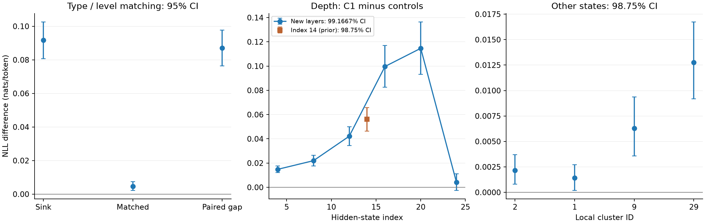

# HSS sink 推广实验：结果

更新：2026-09-25T17:28:21.339492+00:00。只展示完整、通过原始记录审核的实验。

[冻结协议](sink-next-protocol-20260925.zh-CN.md) · [此前 v3 能量匹配结果](sink-energy-matched-results-20260925.zh-CN.md)

**性质：探索性延伸，沿用此前已经检查过的问题；不是新样本确认实验。** NLL 单位为 nats/token，正差表示模型对既定参考续写的支持下降。

## 1. 同题型、同难度

96 对精确匹配；放宽一级 0 对；未匹配 0 条。两组都使用 half_sentence 后半段窗口。

| 量 | 均值 [95% CI] |
|---|---:|
| Sink：C1−NONE | 0.09165 [0.08063, 0.10263] |
| 匹配非 sink：C1−NONE | 0.00459 [0.00225, 0.00744] |
| 主终点：匹配对差 | **0.08706 [0.07638, 0.09768]** |

| 组 | 越界 token 比例（逐题均值） | 正超出量均值 | 实际更新范数均值 |
|---|---:|---:|---:|
| matched | 34.83% | 1.13246 | 1.13298 |
| sink | 66.56% | 4.58257 | 4.58309 |

结果超出已匹配的题型和难度。仍可能存在长度、回答内容等差异；两组自然截断的实际剂量不同，所以不把本项单独解释为完全排除题目因素或证明生成模式。

本项 sink NLL 与 v3 的数值不同，是因为按预定规格统一改为 half_sentence，而 v3 包含 first_repeat 窗口。

English: With problem type and difficulty matched in 96 independent pairs, the sink-minus-control difference in the clamp-induced NLL increase was 0.0871 nats/token (95% CI [0.0764, 0.0977]).

## 2. 深度扫描

主列为 sink 的 C1−10 个对照均值；六个新层区间为 99.1667%（Bonferroni 6）。normal 列为描述性95%区间。

| Index | Sink 主对比 [校正 CI] | Normal C1−NONE [95% CI] | Normal C1−对照 [95% CI] | cos(axis, axis14) |
|---|---:|---:|---:|---:|
| 4 | 0.01483 [0.01220, 0.01751] | 0.00019 [-0.00005, 0.00043] | 0.00019 [-0.00002, 0.00040] | 0.41670 |
| 8 | 0.02196 [0.01758, 0.02643] | -0.00017 [-0.00046, 0.00010] | -0.00019 [-0.00041, 0.00001] | 0.72233 |
| 12 | 0.04214 [0.03437, 0.04999] | -0.00029 [-0.00062, 0.00005] | -0.00040 [-0.00070, -0.00011] | 0.89705 |
| 16 | 0.09967 [0.08253, 0.11699] | -0.00055 [-0.00091, -0.00018] | -0.00080 [-0.00113, -0.00050] | 0.90327 |
| 20 | 0.11466 [0.09313, 0.13650] | -0.00095 [-0.00135, -0.00054] | -0.00132 [-0.00171, -0.00095] | 0.75352 |
| 24 | 0.00402 [-0.00251, 0.01106] | -0.00222 [-0.00275, -0.00170] | -0.00273 [-0.00334, -0.00214] | 0.61532 |

Index14 复用 v3：0.05614 [0.04643, 0.06580]，98.75% CI；未重新纳入六个新层的校正。

| Index | Sink 越界比例 | Normal 越界比例 | Sink 实际更新范数 | Normal 实际更新范数 |
|---|---:|---:|---:|---:|
| 4 | 48.74% | 22.67% | 1.31613 | 0.24368 |
| 8 | 58.25% | 21.11% | 2.72304 | 0.31400 |
| 12 | 63.75% | 20.35% | 4.04858 | 0.38453 |
| 16 | 63.84% | 20.06% | 5.34409 | 0.45400 |
| 20 | 64.13% | 19.79% | 9.60938 | 0.78149 |
| 24 | 58.11% | 20.71% | 19.47538 | 2.15569 |

每层单独干预，同一评估人群和窗口。完整10个对照保存在 JSON 中。层间效应曲线不是等剂量比较，不能直接称最大效应层为最重要层。

## 3. 四个其他高占用状态

已按训练集占用人数预选，队列运行中；完整审核结果尚未同步，不报告部分效应。每个状态的 in-B 最多100条，out-B最多100条，不重复采样补足。

## 4. 自由生成

已冻结、按依赖顺序运行；完整审核结果尚未同步，当前不报告部分效应。152道sink题+50道正常题，zero/C1/ORTH_MAN_1，共606条记录。

## 范围与追溯

第二个模型按用户规格留到讨论期。所有结果须在用户指定2026-09-26 01:59 UTC之前完成审核才能进入投稿版；这里不核实会议官方截止日期。

| 实验 | 完成审核 UTC | 投稿冻结前 | Plan SHA256 |
|---|---|---|---|
| 1 | 2026-09-25T16:38:28.371280+00:00 | True | `80aedd973ac71826f216e74648cb20ba21ccb0c00ff939b3b9bca078e2a0e798` |
| 2 | 2026-09-25T17:25:50.449973+00:00 | True | `9beb353f32435eb2a993784671ba9e7645bc0e05edc0b23838c5bdad96dedaaa` |

原始逐token logprobs、token IDs、更新量和收据在 Lambda `/lambda/nfs/dami/hss/sink-next-20260925/exp*/`；轻量副本在本地 `results/sink-next-20260925/`。完整10方向明细见各项 [JSON](sink-next-20260925/)。
