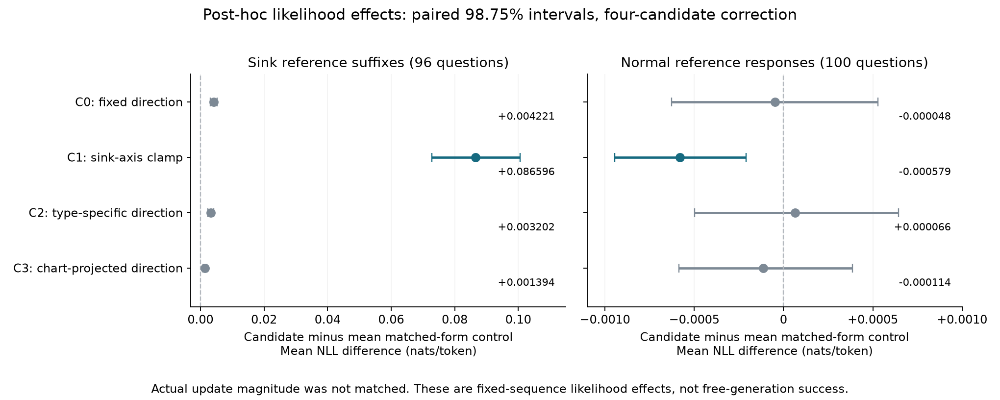

# Sink steering：行为耦合与续写抑制的次要分析

**2026-09-25；CPU-only；Qwen2-7B-Instruct。** 本次不生成新回答、不改变原标签、不修改原 D6 筛选结论。用户指定的退化定义、四候选完整汇报、统计单位与多比较口径，在计算本次细分结果前保存于 `configs/sink_secondary_20260925.json`。这是已知主终点结果之后的次要分析，不是新的确认性试验。

## 结论

**有一个统计上清楚的正结果：C1 单轴截断降低了冻结 sink 回答后缀的似然，其影响超过全部10个既定截断对照。** 在正常回答上，相对对照均值的 NLL 反而略低。它支持“这个干预算子对 sink 关联续写具有可测的功能影响”。

**尚不能写成显著逃离 sink，或已经证明 sink 就是退化计算状态。** 同题状态与行为切换的检验不显著；退出与进入的净比较不显著；截断对照也没有匹配实际改变量。下面分别给出结果和可直接使用的英文。

## 1. 行为定义和统计单位

- 退化：没有完整、非空、括号配平的 `boxed`，**或**新生成 token 数达到2,048。定义未按结果修改。它是格式／截断指标，不是数学正确性，也不是专门的循环标签。
- 状态：无干预 teacher-forced 重编码后，冻结 response-mean GMM 在 hidden-state index14 上的 global ID 是否为24。
- 三个生成条件：zero、HSS方向、random方向。历史原回答因 generation config 不同，不进入此配对检验。
- 总计155题：历史sink组55题＋正常组100题；每题3条回答、3对比较。
- 同题3对比较不独立。主检验固定每题sink／退化边际，枚举在其3条回答间置换退化标签的精确条件分布。统计量为题内所有配对的 `(sink差值×退化差值)` 之和。bootstrap以题目为单位，并保留55／100的群体分层。
- 另分别报告zero–HSS、zero–random、HSS–random的符号检验，对三项校正。没有将465个回答对当作465个独立样本。

## 2. 状态是否跟着行为走？

全部465个回答对中，**50对的sink归属不同**，涉及25道题：

| 状态与行为的关系 | 回答对数 |
|---|---:|
| 同向：sink回答退化、非sink回答正常 | 17 |
| 反向：sink回答正常、非sink回答退化 | 8 |
| 状态不同，但退化状态不变 | 25 |

如果只看状态、行为都发生变化的25对，同向比例为 **68.0%**，题目bootstrap95%区间 **[42.9%,89.7%]**；这些25对只来自17道题。包含行为不变的所有sink不一致配对时，同向变化为 **17/50=34.0%**。

**主检验p=0.196927。** 因此不能填出“高度一致且显著”的英文结论。题目相同确实有助于去除固定题目属性，但现有变化题太少，且一半状态变化没有对应行为变化。

| 单独配对，合并155题 | 同向／反向 | 原始双侧p | Bonferroni×3 |
|---|---:|---:|---:|
| zero–HSS | 6／3 | 0.5078 | 1.0000 |
| zero–random | 6／2 | 0.2891 | 0.8672 |
| HSS–random | 5／3 | 0.7266 | 1.0000 |

## 3. 离开与进入，以及boxed恢复

### 原55道sink选题

| 条件 | zero仍在sink的25题中退出 | zero不在sink的30题中进入 | 最终在sink | 退出／进入McNemar p |
|---|---:|---:|---:|---:|
| HSS | 10 | 4 | 19 | **0.1796** |
| 随机方向 | 9 | 6 | 22 | 0.6072 |

HSS退出的10题：**4题新获得完整boxed、1题原来就有且保留、3题反而丢失boxed、2题始终没有boxed。** 因此“退出后有5题boxed”不能改写成“恢复了5题”；真正新增的是4题。退化→非退化也为4题，自动正确性没有新增修复。随机方向退出的9题中，有3题新获得boxed。

HSS与随机方向在同样25题上的退出比较仍为10对9，配对McNemar p=1.0。

### 包含正常100题后的总结果

HSS **11出／4进**，p=0.1185；随机 **10出／7进**，p=0.6291。加入正常题未使退出结果显著。仅报告退出而遗漏进入会夸大效果。

## 4. C0–C3是否降低原sink续写的似然？

原始变量 `m_loop` 实际是截断点之后、固定历史续写的**平均每token NLL**，包含保存的EOS。NLL增大代表模型更不支持原来那段续写。

97道sink B题里，96题后缀长度达到冻结要求；`math_2831`后缀过短，所有条件统一排除。正常对照100题的 `m_col_nll` 是完整历史回答的平均每token NLL。这些正常题不保证数学正确。

下表均为nats/token，正值表示固定文本受到抑制。每题配对bootstrap100,000次，**98.75%区间在每个明确的比较族内对4个候选作Bonferroni校正**；不声称对整个项目所有事后分析控制了整体错误率。

| 候选 | sink ΔNLL，相对NONE | 98.75%区间 | 相对10个对应对照均值的额外ΔNLL | 98.75%区间 |
|---|---:|---|---:|---|
| C0 固定方向 | +0.004887 | [+0.003736,+0.006029] | +0.004221 | [+0.003151,+0.005281] |
| **C1 sink轴截断** | **+0.086711** | **[+0.072930,+0.100638]** | **+0.086596** | **[+0.072817,+0.100536]** |
| C2 题型正确方向 | +0.003868 | [+0.002880,+0.004840] | +0.003202 | [+0.002284,+0.004107] |
| C3 局部基投影方向 | +0.002624 | [+0.001905,+0.003345] | +0.001394 | [+0.000717,+0.002090] |

点估计超过10个对照的数量分别为 **10、10、10、9**。进一步做四候选×十对照的40项配对比较，使用99.875%区间后，区间完全大于零的数量为 **10、10、8、5**。

**C1超过全部10个对照不只是点估计排序：全部10项校正区间均大于零，最小下界为+0.068568 nats/token。** 对照包含5个各向同性方向和5个非sink中心差方向，都使用同形式的截断和各自正常分布75%分位阈值。

### 正常回答上的影响

| 候选 | normal ΔNLL，相对NONE | 98.75%区间 | 相对对应对照均值 | 98.75%区间 |
|---|---:|---|---:|---|
| C0 | +0.000339 | [−0.000314,+0.000977] | −0.000048 | [−0.000626,+0.000529] |
| **C1** | **−0.000354** | **[−0.000771,+0.000053]** | **−0.000579** | **[−0.000944,−0.000209]** |
| C2 | +0.000453 | [−0.000153,+0.001066] | +0.000066 | [−0.000497,+0.000645] |
| C3 | +0.000620 | [+0.000197,+0.001069] | −0.000114 | [−0.000585,+0.000387] |

C1相对正常对照**均值**的NLL较低，区间不跨零；不能说它显著优于每一个正常对照。相对NONE的区间跨零，也不应据此声称证明了严格无副作用。

控制调整后的sink−normal差为 **+0.087175，[+0.073391,+0.101090]**。这是两个群体、不同评分窗口（sink后缀／normal全文）的诊断比较，不是同文本上的严格交互因果识别。

## 5. 能称为“循环抑制”吗？

97道sink题里，33题触发既有的完整句子重复检测，64题没有重复触发而在接近中点的句界切分。33题中有1题后缀过短，所以可评分的重复子集为 **32题**。

预定描述性子集结果：C1相对NONE增加 **0.074000 nats/token**，相对对应对照均值增加 **0.073886**，点估计超过全部10个对照。这和主后缀结果方向一致。

但后缀包含重复检测点之后的所有文本，不只重复片段；完整句子重复也不等于持续循环。该子集没有在本次计划中设置独立确认性检验。**主文应写“sink-associated continuations”，不要把全部96题都称为loops。**

## 6. 重要的改变量审计：显著差异不等于已隔离方向优势

在看到次要结果后，又从原始执行记录导出实际BF16改变量，目的是检查对照是否可解释，不重新选择参数。这是描述性审计。

| 在完整参考回答上测量 | C1 | 对应10个截断对照范围 |
|---|---:|---:|
| sink96：平均逐token改变量norm，再按题平均 | **4.583** | **0.024–0.288** |
| normal100：同一指标 | 0.372 | 0.077–0.630 |

C1改变量与原token norm的“每题均值之比、再按题平均”为sink **10.60%**、normal **0.84%**；被实际修改的token比例为 **66.63%／21.17%**。

因此这组对照是**同算子形式／同阈值规则**，不是同实际扰动能量。C1作用于sink回答更强，是这个规则的行为特点，也构成方向特异性解释的混杂。不能将结果写成“保持改动大小相同，只有HSS方向能抑制循环”。

此外C1没有额外乘alpha=0.3。alpha=0.3是加法干预的设置，不能拿来形容本次截断强度。

## 7. 可直接使用的英文结果段落

### 主结果段：推荐措辞

**Sink-axis clamping attenuates sink-associated continuations.** In a post-hoc analysis of the frozen teacher-forced evaluation, we examined whether interventions reduced support for continuations from sink-selected responses. Clamping excess activation along the sink axis at block 14 (C1) increased suffix negative log-likelihood by 0.0867 nats/token relative to no intervention (98.75% question-bootstrap CI [0.0729, 0.1006]; 96 questions). Its increase exceeded the mean of ten same-form clamp controls by 0.0866 nats/token [0.0728, 0.1005], and all ten individual contrasts remained positive with Bonferroni adjustment across the 40 candidate–control comparisons. On 100 normal-response controls, C1 changed full-response NLL by −0.000354 nats/token [−0.000771, 0.000053] relative to no intervention, and by −0.000579 [−0.000944, −0.000209] relative to the mean clamp control. These results show that the sink-axis clamp differentially affects support for sink-associated versus normal reference continuations. However, the controls matched the clamp form and threshold rule rather than realized perturbation magnitude: the mean update norm on sink responses was 4.58 for C1 versus 0.024–0.288 for the controls. The experiment therefore establishes an operator-level effect on continuation likelihood, not an energy-matched directional advantage or improved free-generation outcomes.

### 行为验证段：建议紧接着报告

**Geometric exits do not yet establish behavioral recovery.** In the free-generation pilot, 10 of the 25 responses that remained in the sink under zero intervention exited under the HSS direction, compared with 9 under a norm-matched random direction. Four of the ten HSS exits newly recovered a complete boxed answer. Across all 55 historically sink-selected questions, however, HSS also induced four entries, and the net exit–entry difference was not significant (two-sided exact McNemar p=0.180). Pooling the 55 sink-selected and 100 normal questions, 50 within-question response pairs differed in sink membership: degeneration changed concordantly in 17 pairs, oppositely in 8, and remained unchanged in 25. A question-stratified exact conditional test did not establish state–behavior coupling (p=0.197). We therefore distinguish the observed geometric exits and likelihood effects from evidence of reliable behavioral rescue.

### 表注／方法脚注

Degeneration was fixed as an absent complete nonempty boxed answer or reaching the 2,048-token generation limit. NLL intervals use 100,000 paired question bootstrap resamples; 98.75% intervals adjust over four candidates within each reported endpoint/comparison family, while the 40 individual candidate–control contrasts use 99.875% intervals. The repeated-sentence subset is descriptive. These analyses were specified after the primary outcomes were known and do not alter the original screening decision. The normal-response cohort was not restricted to mathematically correct answers. Historical cohort collection used repetition_penalty=1.05, whereas pilot generation used 1.0; all pilot arms shared the latter setting. Existing representation maps were fitted before the follow-up A/B split.

## 8. 这是否满足想展示的“至少有用”？

**若“有用”指能定向地削弱指定参考续写的模型支持，已有显著的功能结果；若指显著增加逃离sink或恢复正常生成的概率，目前仍未得到。** 这两个主张的区别应写清楚。

C0也有显著后缀NLL变化，但原自由生成未显示boxed改善。这提供了本项目内部的直接提醒：降低原续写似然，不自动产生更好的替代续写。

若要补最有价值的一项确认，优先做C1的**实际逐token改变量匹配对照**，随后在新问题上测净退出／进入和行为恢复。不能用继续重述现有p值替代这一缺口。本次没有启动新的GPU实验。

## 9. 来源与可复算文件

- 输入：`results/sink-followup-20260925/step1_reencode.parquet`、`step2_screen_long.parquet`，首先对照冻结SHA256。
- 固定分析配置SHA256：`13aee7ee640295d88caed353454658236d5829b6e5ea600215dfe8ec42c5898f`。
- 结果：[summary.json](sink-secondary-20260925/summary.json)，包括全部对照、逐项区间、每群体退出／进入、子集数量。
- 改变量：[geometry_summary.json](sink-secondary-20260925/geometry_summary.json)。原始导出2,167条的SHA256为 `b6649ca389d14a1d8e74b289333e168ddc9a13e6a4114152544a5c87c233f6e2`。
- 独立审核：[independent_audit.json](sink-secondary-20260925/independent_audit.json)。用另一套逐题枚举方法复核精确p，复算所有候选／对照均值，并用独立index-resampling20,000次确认C1所有10项校正区间仍为正。
- 完整本地输出：`results/sink-secondary-20260925/`；逐题回答对留在 `behavior_pairs.json`。

```bash
OPENBLAS_NUM_THREADS=1 OMP_NUM_THREADS=1 .venv/bin/python scripts/analyze_sink_secondary.py
```


