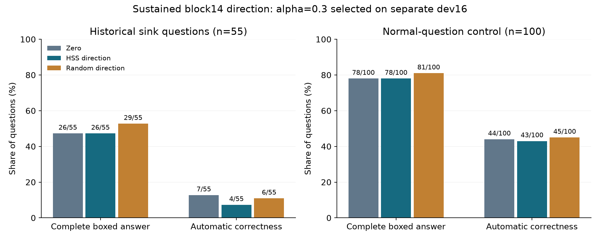
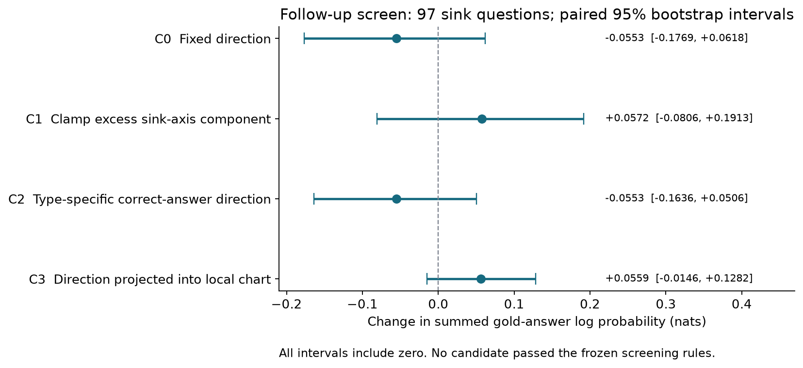
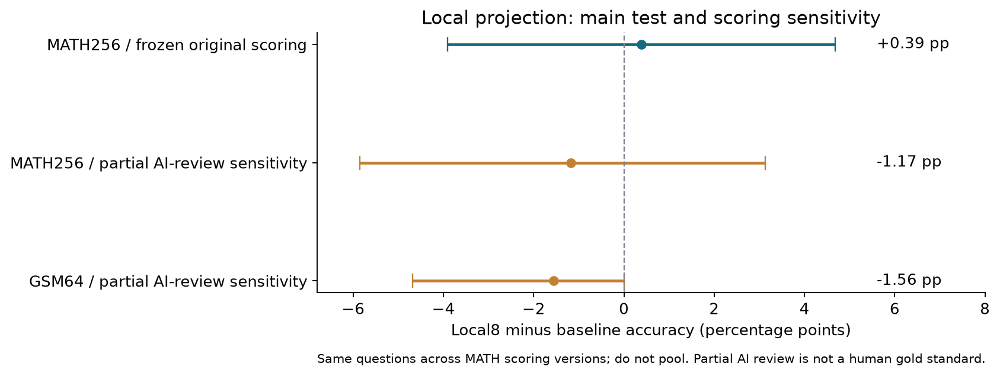

# Steering 完整报告

**更新：2026-09-25。模型：Qwen2-7B-Instruct。** 本报告以最近的 sink 方向干预及其后续筛选为主，并汇总此前局部投影、目标区域迁移和十项消融。只整理已保存结果，没有新增生成、重选参数或覆盖原评分。

## 结论先读

1. **目前没有获得经后续测试确认的稳定纠错收益。** 局部投影在 MATH 开发集上改善，256 题测试上为 129→130，净 +0.39 个百分点，95% 区间跨零。统一重评分和部分 AI 全文核验后为 154→151，仍不支持净收益。
2. **持续沿“非 sink−sink”方向推动，也没有确认改善。** 开发集完整 boxed 从 5/16 到 9/16；55 题测试为零干预 26、HSS 26、随机 29。离开冻结 sink 的配对检验也没有显示 HSS 优于随机。
3. **后续 35 条件筛选全部完成，但没有新策略通过冻结门槛。** C1 限制 sink 轴过量分量最值得保留为线索；它的答案对数概率增量为 +0.0572 nats，但区间 [−0.0806,+0.1913] 包含零。没有进入新的自由生成验证。
4. **仍有探索性线索，不应抹掉。** 十项消融中的“减去窗口共同残差”D10 在原验证子集 32 题上有正点估计；它未经新测试确认，也未超过这些题上的原 local8。重构保真上的 Local8 优势是另一个已支持的结果，不能写成正确率提高。
5. **一个必须披露的配置差异：** 历史采集继承 Qwen 的 repetition_penalty=1.05；本轮 steering 显式使用 1.0。当前各干预组之间配置一致，但零干预没有逐字复现历史回答。历史数据选出的 sink 题，在当前设置下不一定仍落入 sink。

---

## 1. 三类实验究竟改了什么

| 实验 | 用的几何对象 | 实际修改 | 修改时间 | 核心终点 |
|---|---|---|---|---|
| 局部投影／重构后自由生成 | 单 token 地图的中心和局部 8 维基 | 用当前区域的低秩近似替代部分 activation | 自然生成 16 token 后，重放时改第 13–16 个生成位置；随后撤掉 hook | 最终自动正确率 |
| sink 固定方向 | 完整回答 token-mean 地图 | 在每个被送回模型的生成 token 上加同一向量 | block14，持续到回答结束；prompt 不改 | 完整非空 boxed，正确率另报 |
| sink 后续 C0–C3 筛选 | 回答均值方向＋token 局部基 | 加向量、单轴截断、题型方向或局部投影方向 | block14，在固定序列的生成位置上做 teacher forcing | 标准答案后缀对数概率 |

三者都不是“把一个错误 ID 换成正确 ID”。cluster 只是决定中心、方向或局部基的来源。不同协议里 C1/C2 的名字有重用；下文“后续 C1”专指单轴截断，不是此前的 local8。

**层位置统一：** block14 是第 14 个 transformer block 的输出，代码为 `model.model.layers[13]`，对应保存的 `hidden_states[14]`，维度 3,584。不是 `layers[14]`，不是最后 RMSNorm 之后，也没有同时干预所有层。

模型固定为 `Qwen/Qwen2-7B-Instruct`，revision `f2826a00ceef68f0f2b946d945ecc0477ce4450c`，HF Transformers、BF16、SDPA、batch1、greedy、最多 2,048 新 token。

---

## 2. 最近的 sink 是怎么选出来的

使用现有 Qwen × MATH 5,000 题完整回答 token mean 的对角 GMM；block14 按 2% ICL 容差选出 **K=33**。不重拟合、不额外 normalization。每题一个向量：对该题生成 token 的 block14 向量求平均，均值口径包含保存的 EOS／特殊 token。

在原 train 的 3,011 题上，要求候选簇至少 50 题、完整 boxed 率不超过 30%，取 boxed 率最低的簇。该簇为 **local cluster8**，在本次一致的跨层编号中为 **global24**。

- 全量共有 325 题，历史自动正确 9/325。
- 原训练／验证／测试分布为 197／73／55。
- 本次开发集从 73 道验证题中按固定 hash 选 16 题；测试使用全部 55 道对应测试题。
- 正常题对照另取 100 道非该簇、历史回答有完整 boxed 且未截断的题，不要求历史回答正确。

这是一个**退化输出候选区域**，不是已证明的错误计算状态。已检查的原文包含长篇解释后不给具体答案、未 boxed 的有效数值结论，以及少量完整回答。当前数据没有空生成，不能写成“sink 全部为空白”。它也没有被证明就是旧稿中同名或同 ID 的 sink。

方向为：

\[
d=\frac{1}{|N_{train}|}\sum_{i\in N_{train}}\bar h_i-
\frac{1}{|S_{train}|}\sum_{i\in S_{train}}\bar h_i.
\]

这里使用训练问题的均值，而不是包含测试数据的 GMM 中心。**非 sink 组仍同时包含正确和错误回答**；该方向的原目标是离开这类退化输出，不是一个按正确标签直接构造的纠错方向。

已有 GMM 地图本身在全部 5,000 题上无标签拟合，所以它是 transductive 地图。训练／开发／测试分开的是这次方向估计与参数选择，不能声称测试题从未被整个项目或地图见过。

## 3. 固定方向如何介入自由生成

对每个被前向处理的生成位置执行：

\[
h'_{14,t}=h_{14,t}+\alpha d.
\]

每题从原 prompt 重新生成，使用全新 KV cache。prompt prefill 完全不改。第一个输出 token 由原 prompt-last 状态决定；当该 token 被送回模型、准备预测第二个 token 时，开始在其 block14 输出加向量，此后持续修改。最后新输出的 token／EOS 如果不再进入下一次前向，也不会被 hook 修改。

三组为：zero、HSS 方向、一个预先固定的等范数随机方向。随机方向没有根据效果筛选。alpha=0.3 时理想扰动范数约 1.971；真实 BF16 改变量略受舍入影响，已经逐步记录。

对固定 token 向量一起加 d，均值确实会平移 d；但自由生成会改变 token、上游状态和回答长度，因此**最终回答均值不保证只是原均值加 alpha×d**。是否离开 sink 必须重新测，不能由加法公式代替验证。

## 4. 开发集选参：为什么 5→9 不等于已经成功

| alpha | 完整 boxed / 16 |
|---|---:|
| 0，零干预 | 5 |
| 0.1 | 7 |
| 0.3 | 9 |
| 1.0 | 8 |

按开发集 boxed 数最高、平局选较小 alpha，冻结 **alpha=0.3**。这一步在选择参数，不能拿同一批题再确认方法有效。没有因为收益不稳定而继续搜索更多 alpha。

主终点严格定义为存在括号完整、内容非空的 `\boxed{...}`。它测格式遵从：不是所有答案的语义可解析率，也不是数学正确率。正确率使用冻结的 OpenAct 自动评分，另外报告。

## 5. 55 道 sink 测试题：完整结果

| 条件 | 完整 boxed | 自动正确 | 截断 | 平均新 tokens |
|---|---:|---:|---:|---:|
| 零干预 | 26/55（47.27%） | 7/55（12.73%） | 4/55 | 918.6 |
| HSS，alpha=0.3 | 26/55（47.27%） | 4/55（7.27%） | 8/55 | 983.1 |
| 等范数随机方向 | 29/55（52.73%） | 6/55（10.91%） | 6/55 | 986.9 |

主要比较 HSS−随机方向的 boxed 比例：**−5.45 个百分点，95% 配对区间 [−20.00,+10.91]，预定单侧精确 McNemar p=0.8204**。HSS 相对零干预净变化为零，逐题有 9 次增加 boxed、9 次丢失 boxed。

自动正确性上，HSS 相对零干预是 0 次修复、3 次损伤，净 −5.45 个百分点。该点估计不支持纠错收益；仍不应据此把模型的一切 steering 都判为无效。预定成功规则未满足。

### 100 道正常题的副作用

| 条件 | 完整 boxed | 自动正确 | 截断 | 平均新 tokens |
|---|---:|---:|---:|---:|
| 零干预 | 78/100 | 44/100 | 5/100 | 514.7 |
| HSS | 78/100 | 43/100 | 3/100 | 503.0 |
| 随机方向 | 81/100 | 45/100 | 3/100 | 534.5 |

HSS−零干预正确率为 −1 个百分点，95% 区间 [−6,+4]；逐题 3 修复、4 损伤。没有明显净改善，也没有用这个样本量证明严格无副作用。

本轮完成 **529 次完整生成、376,569 个新 token**，生成阶段约 **2.59 小时**；包括开发集 64 次和测试集 465 次。所有原文、token ID、扰动几何和文件凭据保存。

### 三个自动“损伤”例子的含义

此前已对三个 sink 损伤例子完整阅读并留档：math_2776 最终值 100→101，属于最终答案损伤；math_2628 的 64→16、math_1672 的 0→错误表达式也改变了终值，但零干预答案本身已有推导漏洞。因而不能把三个例子都描述为“破坏了原本完全正确的推理”。其他所有变化题尚未全面语义复核，冻结评分没有被这些案例局部覆盖。

---

## 6. 后续第 1 步：有没有真的离开 sink

对原 pilot 的 465 条测试回答，加 155 条历史回答，合计 **620 条**，用无干预 teacher forcing 重新提取完整均值和句子前缀状态，放回冻结地图。这里是在测“这些文本在不加 hook 时落在哪里”，不是重跑同一个方向，也不是直接读取干预运行内部的状态。

55 道历史 sink 题：零干预回答中 25 道仍在 sink，HSS 19 道，随机 22 道。但公平比较应固定“当前零干预确实还在 sink”的 **25 道**：

| 结果 | 题数 |
|---|---:|
| HSS 离开 sink | 10/25 |
| 随机离开 sink | 9/25 |
| 仅 HSS 离开／仅随机离开 | 5／4 |
| 双侧精确 McNemar p | 1.0 |

没有确认 HSS 比随机更能离开 sink。沿目标方向的均值位移在 block14 的配对 Wilcoxon p≈0.989，在追踪到的 block27 为 p≈0.801，也没有支持特殊方向效果。block27 在这里是读出检查位置，**没有在 block27 实施干预**。

### 强制作答诊断

对没有完整 boxed 的回答，移除末端 EOS，追加冻结字符串 `\n\nTherefore, the final answer is $\boxed{`，最多续写 40 token；所有组都不加干预。统计“原回答正确或强制作答正确”的并集：

| 群体 | 零干预 | HSS | 随机 |
|---|---:|---:|---:|
| sink 55 | 8 | 5 | 7 |
| normal 100 | 50 | 49 | 50 |

这是额外提示下的诊断，不是原始正确率，也不是把两次正确数直接相加；没有形成 HSS 优势。

## 7. 配置差异与历史复现：必须保留的限制

55 道 sink 与 100 道正常题上，历史文本和当前零干预文本的逐字复现率均为 **0%**。查到的明确配置差异是历史采集继承模型默认 `repetition_penalty=1.05`，pilot 和 follow-up 显式改为 `1.0`。

这不是单纯的“启动耗时”或存储问题；它会改变贪心解码的 token 选择。尚未做同参数对照重放，所以不能宣称它解释了全部不一致。历史正常题正确数 52/100、当前零干预 44/100，也不能算到 HSS 干预头上。

当前 zero/HSS/random 三组共享配置，因此本轮组间比较仍成立；但严格范围应写为“**用历史回答地图选题，在当前解码设置下进行干预**”。固定序列的 activation 精确复算、零 hook 与无 hook 生成一致，只验证实现，不能替代历史自由生成复现。

---

## 8. 后续第 2 步：四种候选到底是什么

把原训练题重新分 A/B：A 包含 sink100＋non-sink1410；B 包含 sink97＋non-sink1404，其中取 100 道合格正常题作副作用对照。新方向、题型方向和阈值仅由 A 构造；已有地图、控制中心和 token 局部基先于 A/B 划分拟合，因此仍不是完全独立的表示发现／验证实验。

| 候选 | 修改方式 | 直观解释 |
|---|---|---|
| C0 | `h′=h+0.3d_A` | 所有位置加相同离开 sink 的方向 |
| C1 | `h′=h−max(h·s−tau,0)s` | 只有 sink 轴分量过量时，删去超出的部分 |
| C2 | `h′=h+0.3v_type` | 朝同题型的正确回答方向移动；使用标签监督 |
| C3 | 把 d_A 投影到当前 token 区域的局部 8 维基，单位化后按统一幅度相加 | 让推动方向依赖 token 所在的局部区域 |

C1 中 s 是指向 sink 的单位方向，tau 来自 A 中非 sink token 投影的 75% 分位；**C1 没有再乘 alpha=0.3，也不是定长更新**。其效果取决于每个 token 超出阈值多少。

C2 优先用同题型、非 sink、自动正确且难度≥4 的回答；支持不足时依次放宽到难度≥3、任意难度、所有题型正确非 sink。目标至少 20 题；同题型 sink 少于 10 题时回退到所有 sink。向量长度统一到 d_A 的长度。这次确实测试了“加入正确性和题型信息”的候选，但它不是第一轮的无标签非 sink 方向。

C3 使用冻结 token 地图的 64 个中心、最近欧氏中心分配、每区域 rank8 基。它是**加投影后的方向**，不是此前把 activation 完整重构成“中心＋8维”那个实验。投影接近零时不修改。

每种算子都有 10 个形式对应的对照：5 个各向同性随机方向＋5 个非 sink 中心差方向。C0/C2 共用加法对照，C1 使用轴截断对照，C3 使用局部投影对照。加法／投影的基准幅度相同，但不能说截断对照逐 token 与 C1 严格等能量。总计 NONE＋4 候选＋30 对照＝**35 条件**。

## 9. 筛选分数怎么计算，全部结果怎样

对 sink B 的每题，按冻结规则选择回答截断点，接上固定强制作答字符串与标准答案，用 teacher forcing 算标准答案后缀的**求和 log probability**。优先在第一次重复的足够长句子开始处截断；没有这类重复时，取最接近回答 token 中点的句子起点；没有内部句界时用 token 中点。规则未按效果调整。原始 token ID 保留，未用重新分词后的 ID 替换。

hook 作用于 prompt 之后的生成位置，包括评分序列中的前缀与继续部分，prompt 不改；每个目标 token 用它前一个位置的 logits 评分。它不是让模型自由猜出答案，也不是只改前缀后撤 hook 的实验。正增量表示固定条件下标准答案更受模型支持，**不直接等于正确率提高**。

正常题则用模型自己原回答的 boxed 内容评分，避免标准答案书写形式差异混入副作用指标。

| 候选 | 答案 logprob 增量（nats） | 95% 题目配对区间 | 超过对应对照均值 | 正常题增量 | P1／P2／P3 |
|---|---:|---|---:|---:|---|
| C0 | −0.05535 | [−0.17688,+0.06184] | 1/10 | −0.006561 | 不通过／不通过／不通过 |
| C1 | +0.05724 | [−0.08064,+0.19134] | 10/10 | −0.000369 | 不通过／通过／通过 |
| C2 | −0.05530 | [−0.16362,+0.05058] | 1/10 | −0.003815 | 不通过／不通过／通过 |
| C3 | +0.05590 | [−0.01461,+0.12821] | 8/10 | −0.001775 | 不通过／不通过／通过 |

全部 **6,895/6,895 条记录、10,290 次评分前向**完成。主要筛选及诊断约 20.7 分钟；还有方向构造、620 条重编码及审计开销。每个候选区间使用 97 道 sink 题，bootstrap 10,000 次；没有把 token 当独立题目扩充样本量。

- P1：增量的 95% 区间下界>0。
- P2：点估计超过对应 10 个对照；原“至少95%”在 10 个对照时等于全部10个。
- P3：正常题平均变化不差于最差对照，且≥−0.10 nats。
- 循环后缀 NLL 变化另报：C0 +0.00489、C1 +0.08671、C2 +0.00387、C3 +0.00262；只是一项诊断，不是绕过前三门槛的通行证。96/97 题达到该后缀长度要求。

四个候选都未通过 P1。C1 的正点估计和对照排序是线索，**不是显著提高正确答案概率的结论**。P2 也不是已经校准的整体假阳性检验，不把“1/11”当作实测错误率。

### 几何诊断

- A 半方向与原完整训练方向的余弦 **0.9965**；估计方向很接近。
- 加法基准幅度约为采样 token 中位数 norm 的 **4.60%**。
- 理想 C1 截断触及 sink B 的 **66.6%** token，正常 B 的 **21.2%**；理想截断不保证 BF16 后每次都产生非零更新。
- 方向在非 sink token PCA 前 8/64/512 维的能量占比为 **26.7%／75.4%／93.7%**。
- 超出 token chart 训练距离99%参考阈值的比例：sink **0.56%**，normal **1.09%**。这是单一距离覆盖诊断，不能据此证明两个分布相同或解释筛选结果。

这些诊断说明方向与几何选择性是可测的；尚未把它们转化为可靠的行为收益。

## 10. 第 3 步为什么没有继续

代码按 D6 得到 **没有新候选通过 P1–P3**，所以 **3A 自由生成验证未执行**。不是因为运行太慢，也不是 3A 跑了之后隐去结果。

规则转到的 **3B** 是“用既有句子级报警器决定何时回退／重试”的分支。它需要旧 Qwen 前缀地图、HSS-NB 参数和 Table 2 阈值；用户确认没有保存。因此 3B 明确记录为 `blocked_missing_artifacts`，**没有执行**。这里的 3B 是步骤编号，不是一个 3-billion 参数语言模型。没有拿 Llama 报警器或临时新训检测器替代原文件。

由此，本轮已执行部分有完整结果；“报警后重试能否帮助”仍没有答案。

---

## 11. 此前局部投影与“换到正确区域”的结果

### 11.1 局部投影自由生成

自然生成前16 token，在重放时对最后4个位置做：

\[
R_s(h)=a_s+U_sU_s^\top(h-a_s),\qquad h'=h+\alpha[R_s(h)-h].
\]

rank8 表示保留当前样本沿该区域8个方向的连续坐标，不是只保留 state ID。选择 alpha=1 后撤掉 hook，让模型自由生成剩余回答。

64 题验证的冻结原评分为 30→37，11修复/4损伤。随后256题主要结果：

| 条件 | 原冻结自动正确数／率 | 相对 baseline 修复／损伤 |
|---|---:|---:|
| Baseline | 129/256，50.39% | — |
| Local8 | 130/256，50.78% | 17／16 |
| 同中心 Shared8 | 127/256，49.61% | 17／19 |
| 三个随机种子，题内平均 | 49.35% | 11.67／14.33 |

Local8−baseline：**+0.39 个百分点，原主报告95%区间 [−3.91,+4.69]**。相对 Shared8 和随机均值的区间也跨零。v2 汇总因 bootstrap 流程的重新抽样，原指标下界略有差异；本报告保留原冻结主报告区间，不选择更有利版本。

### 11.2 正确性更高的邻近区域

原候选中的目标区域策略在最近3个区域里，选择训练题支持≥20、收缩正确率比当前区域高≥0.10的区域；无合格候选就不改。统计按训练问题计票，而不是把同题16个 token 当16个独立标签。

alpha=0.1 和 0.3 在64题验证上均是 **0修复、0损伤、净增益0**，干预覆盖约 **20.3%**。它未被选入后续主测试。这个结果限制的是该邻域、支持阈值、幅度与干预时机，不能改写成“所有正确中心替换都做过且无效”。

### 11.3 迁移与评分敏感性

新 GSM8K 64题中，冻结评分 baseline62、local8 61、shared8 60、wrong-local8 60。Local8−baseline 为 −1.56个百分点，95%区间 [−6.25,+3.125]。这64题属于单独冻结的迁移协议，不等于完整官方 test1,319题。

统一重评分并复用已封存 AI 全文判断后的敏感性结果：

| 比较 | 对照→方法正确数 | 净变化 | 95%区间 |
|---|---:|---:|---|
| 原验证64，Local8 | 35→43 | +12.50pp | [+3.125,+23.4375] |
| 主测试256，Local8 | 154→151 | −1.17pp | [−5.8594,+3.125] |
| GSM64，Local8 | 63→62 | −1.56pp | [−4.6875,0] |

这是**事后、部分 AI 核验敏感性分析**，不是替代冻结主指标的全量人工金标准。2,336条源记录中，438条有精确全文匹配的 AI 阅读依据，涉及359份不同全文；1,898条未逐题阅读。答案提取错误确实影响绝对正确率，但多个评分版本都没有确认主测试净收益。

### 11.4 十项消融：完整保留探索信号

十项消融在原验证集按 hash 取的32题上执行，都是探索性。D07/D08分别使用同触发时刻基线；其余用原prefix16基线。不能从十项中再选一个赢家，声称它已经通过256题确认。

| ID | 改动 | 原评分：对照→方法 | 部分AI核验：对照→方法 | 核验版差值95%区间（pp） |
|---|---|---:|---:|---|
| D01 | 错配局部8维基，中心不变 | 13→15 | 15→19 | [−0.0781,+28.125] |
| D02 | 共享64维 | 13→14 | 15→18 | [−6.25,+25.00] |
| D03 | 局部16维 | 13→16 | 15→18 | [−3.125,+21.875] |
| D04 | 扩大局部子空间的补空间分量，alpha=−0.3 | 13→17 | 15→18 | [0,+18.75] |
| D05 | 只改第16位置 | 13→14 | 15→15 | [−15.625,+15.625] |
| D06 | 改前16个生成位置 | 13→17 | 15→20 | [0,+34.375] |
| D07 | 在prefix8后改末4位置 | 16→16 | 17→18 | [−6.25,+15.625] |
| D08 | 在prefix32后改末4位置 | 15→18 | 16→19 | [−3.125,+21.875] |
| D09 | 投影后恢复原向量norm | 13→16 | 15→19 | [0,+28.125] |
| D10 | 减去窗口内共同的重构残差 | 13→18 | 15→20 | [+3.125,+28.125] |

D10 是值得保留的探索性正信号：核验版5修复/0损伤。但它相对同一32题的原Local8为 **21→20**，并未显示优于原方案；逐项区间也没有做十项选择的多比较校正。不能把这张表概括成“什么都没用”，也不能据D10直接宣布稳定纠错。

尚未执行的内容包括单独提出的 rank0 当前中心完整替换／小幅回拉、同参数1.05重放，以及不存在原报警器的3B。已有更早功能重构、prompt-last地图、token-mean地图和delta重构属于不同测量；本报告没有将其低KL写作自由生成收益。

## 12. 为什么重构仍有价值，却不能证明 steering 成功

已有冻结 MATH decoder → 新 GSM8K 64题的参考续写实验，在相同8个连续坐标预算下，Local8 的下一 token KL 为 **2.893**，Shared8 为 **4.302**；配对差 **−1.409，95%区间 [−2.131,−0.753]**。这是保留原模型输出的功能证据。

但原模型本身可能会答错。更忠实地保存原输出，不会自动让它变正确。反过来，大幅改变输出也不代表向正确答案移动。因而当前同时成立的是：**区域条件的低秩表示有功能保真价值；这些已测试 steering 策略尚未获得稳定净纠错证据。**

## 13. 可以怎样写进论文

可支持的表述：

> 在固定 Qwen2、指定层与干预时机下，区域条件的局部投影能够改变最终回答，并在部分问题上产生修复与损伤，但开发集上的净正确率收益未在后续测试中确认。持续的 response-mean sink 方向干预也未改善预定格式终点或相对随机对照的 sink 退出率。四种后续方向／截断策略的冻结似然筛选未选出可进入自由生成验证的候选。这些结果限制了将现有几何区域直接解释为可控正确性状态的主张。

暂不支持的表述：已经定位通用错误状态；把答案推离sink就能纠错；选到正确率高的簇就获得正确推理；跨层相同ID有同一因果功能；所有steering均无效。

若后续继续研究，首要问题是统一历史采集和干预的完整 generation config；随后才是对小规模验证线索做新问题确认。这里仅提出解释与未完成事项，没有启动新实验。

## 14. 来源、审核与完整数据

本地结果根目录：`/Users/lixiang/Projects/hidden-states-as-states/results/`；完整远端根目录：`/lambda/nfs/dami/hss/`。下面目录名在两端对应：

| 目录 | 主要来源 |
|---|---|
| `sink-direction-20260925` | `summary.json`、`selection.json`、529条生成记录、`audit_SUCCESS.json`、三例语义阅读 |
| `sink-followup-20260925` | `preparation.json`、`step1_summary.json`、`step2_screen_long.parquet`、`step2_decision.json`、`independent_table_audit.json`、`step3_status.json` |
| `revision-completion-20260924` | `steering_summary.json`、验证与主测试审计、原局部投影生成 |
| `projection-first-v2-20260924` | `summary.json`、十项消融与迁移、`scoring_reviewed_sensitivity_v2/summary.json`及阅读来源 |

原始完整生成、逐token向量、每步扰动和大模型文件主要留Dami。本次报告只打包结论、轻量指标和图，避免下载全部activation。

机器可读汇总：[metrics.json](steering-report-20260925/metrics.json)。它保留各评分版本、全部消融汇总、筛选规则与来源哈希。再生成命令：`.venv/bin/python scripts/build_steering_summary_bundle.py`；需要已有本地轻量来源结果。报告与三张图的便携包为 `results/steering-complete-20260925.zip`，约 240 KB。

关键已审核来源 SHA256：

- sink pilot summary：`dfc517abafb2dfcf1dab0f63669196b67339025d411e9267bf42696df67e8d0b`
- follow-up plan：`62739d48d57d9a35983e49014a596c06e5f047b7904328115f5d63ef9242e435`
- follow-up评分Parquet：`e8c92f8b65abf09fc228851c5bfc0d230d3433518d4089bffe76b1c6a3c83db3`
- 原投影主报告：`c22e0fae0b5810b9281c25ab915996dba89d6a452aaea92cea853ee5039e81aa`
- v2消融汇总：`b3f46f4bd02031f40ce0a3963b66dfd0daaf8fc231030249c869a3c7458637e2`
- 部分AI核验敏感性：`43464782a738d8e7fb21cc271aea73c8bd4b0d4865e9e0e25afedfe9dc0e1837`

实现检查包括真实模型的零hook一致性、保存activation复算、因果token对齐、cached／全序列位置掩码、NumPy／Torch算子一致性；统计审核包括原始文件哈希、完整条件矩阵及题目级配对统计。它们保证本次计算和记录可追溯，**不替代语义金标准或新的独立确认数据**。
